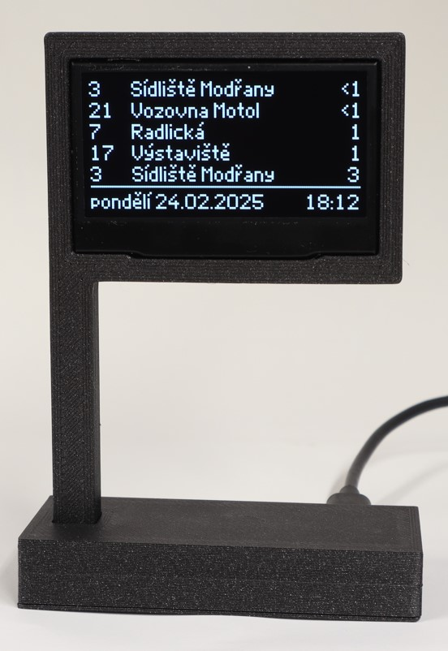

# GolemioEsp32

Project to show Prague Integrated System (http://www.pid.cz) departures from GolemioAPI using ESP32 and 128x64 graphic OLED or 20x4 character LCD display. 

Tested boards are MH-ET LIVE ESP32 MiniKIT and [LaskaKit ESPwled](https://github.com/LaskaKit/ESPwled).
Should be possible to use generic ESP32 S2 and ESP32 C3 board respectively.


[](images/oledespwled.jpg?raw=true "128x64 OLED screen")

[](images/lcd20x4.jpg?raw=true "20x4 LCD screen")
## Required libraries

WiFiManager by tzapu (2.0.17)
https://github.com/tzapu/WiFiManager/tree/master


For LCD version (2.0.2):
LiquidCrystal I2C MultiLingual by Loc P.LE 2.0.2
https://github.com/locple/LCDI2C_Multilingual

For OLED version:
U8g2 by oliver (2.35.30)
https://github.com/olikraus/u8g2

ArduinoJson by BenoitBlanchon (7.2.0)
https://github.com/bblanchon/ArduinoJson

ESP32 3.0.7 board added in board manager

## Wiring

| pin numbers             | SDA | SCL |
|-------------------------|-----|-----|
| MH-ET ESP32Minikit      |  16 |  17 |
| LaskaKit ESPwled (uŠup) |  10 |   8 |

For MH-ET ESP32Minikit, external button on pin 27 is required.

## Setup
- select options in configuration.h
    - uncomment one board
- select display
    - to use 20x4 LCD uncomment ```#define USE_LCD 1```
    - to use 128x64 OLED uncomment ```#define USE_OLED 1```

- upload code

- connect to WI-FI hotspot created by ESP32 
    - password and SSID should be shown on the display
    - GolemioSetup, password
- open the Configuration page
    - enter your WI-FI credentials
    - modify Golemio request parameters according to https://api.golemio.cz/pid/docs/openapi/
    - add Golemio API key
    - click on Save
- if you want to change parameters in the future, press the FLASH/BOOT button on the ESP32 or external button to create Wi-Fi hotspot again

- Wireless update using tzapu webmanager works
    - export binary using Arduino IDE - Sketch -> Export compiled binary
        - it is the sketch_folder/build/board_name/GolemioEsp32.ino.bin
    - start webportal on ESP by pressing a button
    - Android
        - transport compliled binary to the phone/tablet
        - connect to GolemioSetup Wi-Fi
        - on the captive portal select three dots - use network as is
        - in web browser navigate to 192.168.4.1
        - select update in menu
        - wait for update finished message


## Custom BDF font export

bdfconv -v -f 1 -m "0-127,128-255,256-383,688-767" unifont-13.0.06.bdf -o unifont_custom.c -n unifont_custom -d unifont-13.0.06.bdf


https://stncrn.github.io/u8g2-unifont-helper/


## Changelog
- 20251207_0041
    - first application of 256x128 layouts
        - to use uncomment #define MEGAOLED 1

- 20251206_1712
    - first working version of 256x128

- 20250714_1846
    - version number fix
- 20250530_2231
    - first infotexts beta
        - might need to change partition scheme to Minimal SPIFFS
- 20250309_1601
    - dalight saving time fix
- 20250226_2217
    - LCD version debug text fix 3rd row
    - added pin numbers in the description
- 20250225_2336
    - improved debug messages on OLED
    - version during boot
- 20250217_1716
    - move back to PID Departure Boards (v2) 
    - fix date alignment
    - improve minutes 1
- 20250217_1429
    - reconnect fix
- 20250215_2336
    - error -11 fix (timeout value)
    - error 400 fix (content-length)
    - setting moved to file configuration.h
    - added .3mf files of the case
    - optimized for LaskaKit ESP WLED
- 20241224_1935
    - migrated OLED library to u8g2
    - now supports czech language on SSD1309 2.42inch OLED display from LaskaKit 
    - added custom font for display
- 20241224_1532
    - added LaskaKit ESP32-C3-LPKit support
    - readme.md manual modification
    - wifiName changed to GolemioSetup
    - LPkit enable uSup power after boot

- 20241215_1911
    - migrated to tzapu wifi manager, now stable
    - added golemio key back, because even publci API now requires API key
- 20241111_2150
    - migrated all files back to ESP_WiFiManager_Lite
- 20240803_1310
    - wifi not connected on display
    - overwriting unused rows when numbr of departures is smaller than number of available rows
- 20240728_2250
    - can be compiled to ESP8266, works only with 2 departures
- 20240728_2135
    - added images to description
- 20240728_2059
    - fix OLED screen clear code
- 20240728_2001
    - code cleanup
- 20240714_1205 
    - first running example of key-less public API
- 20240714_1025
    - added constant to disable debugging output
    - LCD
        - removed display blinking on refresh
- 20240713_2302
    - basic version working with DO-IT ESP32 without crashing
    - swapped LCD library
    - OLED and LCD parts are separated by '#ifdef'
- 20231114_1802
    - modification of documentation
  

