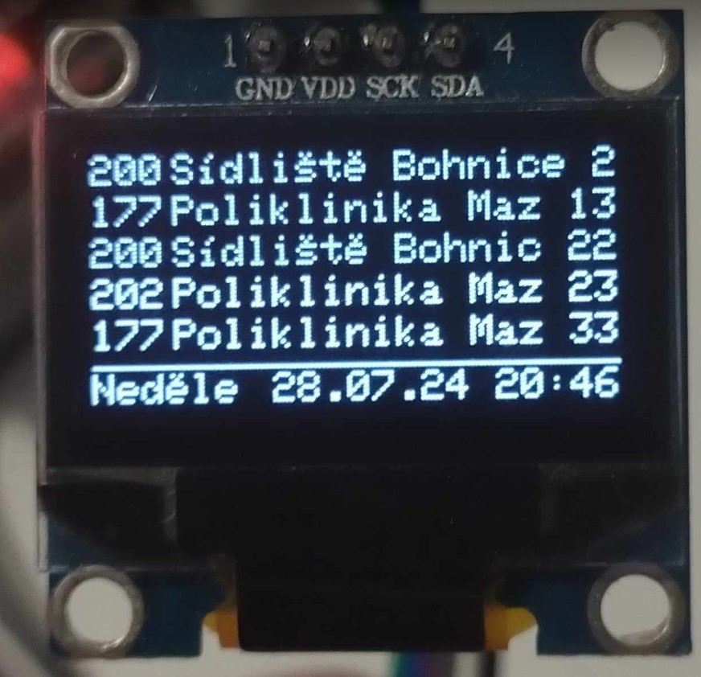

# GolemioEsp32 #

Project to show Prague Integrated System (http://www.pid.cz) departures from GolemioAPI using ESP32 and 20x4 LCD display. This version uses public API no requiring an API key.
Tested board is DOIT ESP32 DEVKIT V1.
ESP8266 doesn't work with more than two departures (problem with gzip encoding in golemio API).

[](images/lcd20x4.jpg?raw=true "20x4 LCD screen")
[](images/oled128x64.jpg?raw=true "128x64 OLED screen")
## Required libraries ##

ESP_WiFiManager_Lite
https://github.com/khoih-prog/ESP_WiFiManager_Lite


Arduino-LiquidCrystal-I2C-library 1.1.2
https://github.com/fdebrabander/Arduino-LiquidCrystal-I2C-library
LiquidCrystal_I2C.h


LiquicCrystal I2C MultiLingual by Loc P.LE 2.0.2
https://github.com/locple/LCDI2C_Multilingual


#include <Adafruit_GFX.h>
#include <Adafruit_SSD1306.h>

Modification of adafruit gfx to support czech characters on 128x64 OLED screen:
https://forum.hwkitchen.cz/viewtopic.php?t=2503


## Setup ##

- modify the code
    - to use 20x4 LCD uncomment ```#define USE_LCD 1```
    - to use 128x64 OLED ucomment ```#define USE_OLED 1```

- upload code
- double press the reset button on the ESP32
- connect to WI-FI hotspot created by ESP32 
    - password and SSID should be shown on the display
    - GolemioDisplay, password
- open the Configuration page
    - enter your WI-FI credentials
    - modify Golemio request parameters according to https://api.golemio.cz/pid/docs/openapi/
    - click on Save


## Changelog ##
- 20240728_2250
    - can be compiled to ESP8266, works only with 2 departures
- 20240728_2135
    - added images to description
- 20240728_2059
    - fix OLED screen clear code
- 20240728_2001
    - code cleanup
- 20240714_1205 
    - first running example of key-less public API
- 20240714_1025
    - added constant to disable debugging output
    - LCD
        - removed display blinking on refresh
- 20240713_2302
    - basic version working with DO-IT ESP32 without crashing
    - swapped LCD library
    - OLED and LCD parts are separated by '#ifdef'
- 20231114_1802
    - modification of documentation
  

